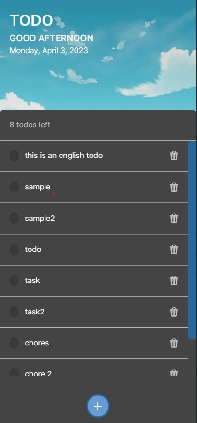

# TODO App

TODO App es una aplicación web que nos permite hacer seguimiento de nuestras tareas del día a día. Podemos agregar, completar y eliminar tareas de nuestra lista de tareas.

## Tabla de contenido

- [TODO App](#todo-app)
  - [Tabla de contenido](#tabla-de-contenido)
  - [Screenshot de la aplicación](#screenshot-de-la-aplicación)
    - [Links](#links)
    - [Usage](#usage)
  - [El proceso](#el-proceso)
    - [Build with](#build-with)
    - [What I learned](#what-i-learned)
    - [Useful resources](#useful-resources)
  - [Author](#author)

## Screenshot de la aplicación

### Links

- [Live Site URL](https://brandon328.github.io/curso-intro-react/)

### Usage

1. Clona este repositorio en un entorno local.
2. Ejecuta el comando `npm install` en la terminal dentro de la carpeta del proyecto.
3. Ejecuta el comadno `npm start` para ejecutar la app en modo de desarrollo
4. Abre <http://localhost:3000> para visualizarlo en el navegador.

## El proceso

### Build with

- HTML5 semántico
- CSS
- Flexbox
- CSS Grid
- JavaScript
- Mobile-first workflow
- NPM - Gestor de paquetes
- [React](https://react.dev/)
- [Git y Github](https://github.com/) - Control de versiones
- [TheCatAPI](https://thecatapi.com/)

### What I learned

Aprendí a usar la librería de javascript React y sus herramientas como el uso de componentes, React hooks (useState, useEffect, useContext).

### Useful resources

- [Create React Content Loader](https://skeletonreact.com/) - Un paquete que agilizó mucho el requerimiento para generar loader skeletons components con ReactJS.
- [react-icons](https://www.npmjs.com/package/react-icons) -  Un paquete de React muy útil para hacer uso de iconos de distintas fuentes como BoxIcons, FontAwesome, entre otros.

## Author

- Website - [Brandon James Huaman](https://www.brandonjj.com)
- Frontend Mentor - [@Brandon328](https://www.frontendmentor.io/profile/Brandon328)
- Twitter - [@BrandonJJ328](https://www.twitter.com/BrandonJJ328)
- Linkedin - [@BrandonJJ](https://www.linkedin.com/in/brandonjj/)
- Github - [@Brandon328](https://github.com/Brandon328)
